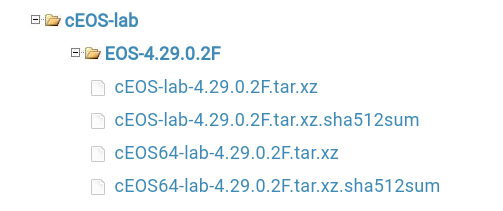

# NATS Demo

This is a demo of the NATS source plugin with event-driven Ansible (EDA).


## Summary

This is a simple demo where we are going to disable an interface. We want to kick off a playbook for testing as we disable the interface. This is one of the primary reasons for EDA. First, an event happens, then we want to react to it.

The idea is that there is a gNMIC process running. It is streaming telemetry for interface Ethernet1. When Ethernet1 goes into a "DOWN" state. The response playbook is automatically executed.

This is all possible, given that gNMIC will take the data from gNMI and output it within the NATS message bus.

## Explanation of file structure

```shell
├── clab.yml // Containerlab file for quick-start
├── Dockerfile // Docker file used to build eda-ansible container
├── gnmic.yml //gNMIC configuration file that references the gNMI path and output for NATS
├── inventory.yml //Inventory for ansible, includes simple localhost
├── nats-eda.py // nats EDA plugin created for this
├── nats-example.yml // the ansible-rulebook created for this demo with a condition
├── response-playbook.yml // Playbook that is ran once the config has been met.
└── startup // startup directory for config files
```

## Requirements

The following tools must be installed before running the demo.

- [Docker](https://docs.docker.com/engine/install/)
- [Containerlab](https://containerlab.dev/install/)
- Arista cEOS image

### Arista cEOS import

This lab requires the Arista cEOS container image to execute correctly. Please follow these steps to make the image available for Containerlab.

1. Create an [Arista](https://www.arista.com/en/login) account, image access should be available right after verifying.
2. Head to [software downloads](https://www.arista.com/en/support/software-download).
3. This example uses the latest available at the time of this writing.
    
4. Now that the image is downloaded, we need to make it available to Docker and Containerlab.

    ```shell
    docker import cEOS-lab-4.29.0.2F.tar ceos:4.29.0.2F
    ```

## Deploy the lab

At this point, we have all the requirements to deploy the lab. However, if you selected another version than the one mentioned in our `clab.yml` file, make sure to make that modification.

```yml
topology:
  kinds:
    ceos:
      image: ceos:4.29.0.2F
```

```shell
sudo clab deploy -t clab.yml
```

## Subscribe to the NATS topic if necessary for debugging purposes (optional)

```shell
./natssub or go run main.go
```

### Output

```shell
2022/12/06 08:59:58 Listening on [test]
2022/12/06 09:00:01 [#1] Received on [test]: '[{"name":"sub1","timestamp":1670273612118710138,"tags":{"interface_name":"Ethernet1","source":"172.20.20.3","subscription-name":"sub1"},"values":{"/interfaces/interface/state/admin-status":"UP"}}]'
```

### Login to EDA container

In this example, we will use the "eda" container to run our rule-book.

```shell
docker exec -it eda bash
cd tmp/
ansible-rulebook --rulebook nats-example.yml -S $PWD -i inventory.yml --verbos --debug
```

#### Output

```shell
DEBUG:asyncio:Using selector: EpollSelector
DEBUG:ansible_rulebook.app:Loading rules from the file system nats-example.yml
INFO:ansible_rulebook.app:Starting sources
INFO:ansible_rulebook.app:Starting rules
INFO:ansible_rulebook.engine:run_ruleset
SLF4J: Failed to load class "org.slf4j.impl.StaticLoggerBinder".
SLF4J: Defaulting to no-operation (NOP) logger implementation
SLF4J: See http://www.slf4j.org/codes.html#StaticLoggerBinder for further details.
INFO:ansible_rulebook.engine:ruleset define: {"name": "Listen for events on nats", "hosts": ["all"], "sources": [{"EventSource": {"name": "nats-eda", "source_name": "nats-eda", "source_args": {"subject": "test", "host": "127.0.0.1", "port": 4222}, "source_filters": []}}], "rules": [{"Rule": {"name": "check down interface", "condition": {"AllCondition": [{"EqualsExpression": {"lhs": {"Event": "values._interfaces_interface_state_admin_status"}, "rhs": {"String": "DOWN"}}}]}, "action": {"Action": {"action": "run_playbook", "action_args": {"name": "response-playbook.yml"}}}, "enabled": true}}]}
INFO:ansible_rulebook.engine:load source
INFO:ansible_rulebook.engine:load source filters
INFO:ansible_rulebook.engine:Calling main in nats-eda
INFO:ansible_rulebook.engine:Waiting for event from Listen for events on nats
```

This will sit and listen at this point for all NATS events.

### Triggering EDA event from switch

Log into the switch and disable  interface Ethernet1.

```shell
docker exec -it ceos2 Cli
ceos2>en
ceos2#conf t
ceos2(config)#int eth1
ceos2(config-if-Et1)#shutdown
ceos2(config-if-Et1)#
```

The running subscribe debugger:

```shell
2022/12/06 09:03:51 [#5] Received on [test]: '[{"name":"sub1","timestamp":1670335407832866095,"tags":{"interface_name":"Ethernet1","source":"172.20.20.3","subscription-name":"sub1"},"values":{"/interfaces/interface/state/admin-status":"DOWN"}}]'
```

The ansible rule-book response:

```shell
INFO:ansible_rulebook.builtin:ruleset: Listen for events on nats, rule: check down interface
INFO:ansible_rulebook.builtin:Calling Ansible runner

PLAY [localhost] ***************************************************************

TASK [Gathering Facts] *********************************************************
ok: [localhost]

TASK [debug] *******************************************************************
ok: [localhost] => {
    "msg": "You have a down interface get a fix going!"
}

PLAY RECAP *********************************************************************
localhost                  : ok=2    changed=0    unreachable=0    failed=0    skipped=0    rescued=0
```

## Cleanup

When testing is complete, make sure to destroy the lab.

```shell
sudo clab destroy -t clab.yml --cleanup
```
